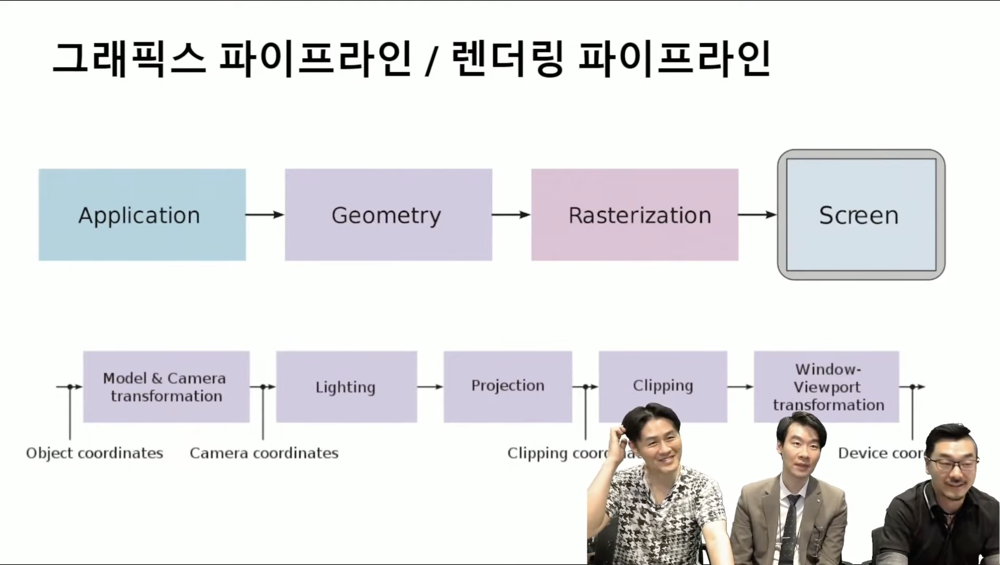
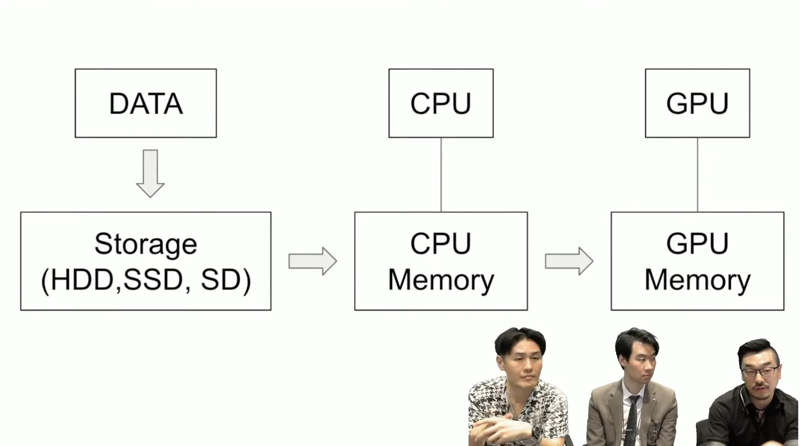
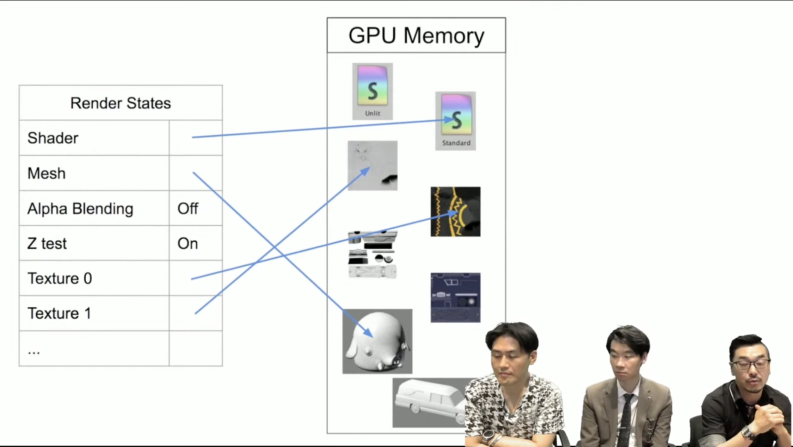
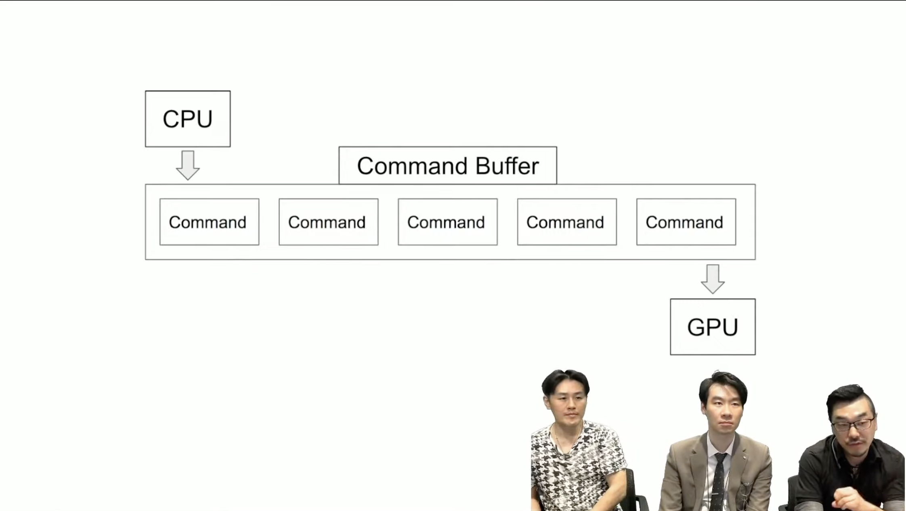
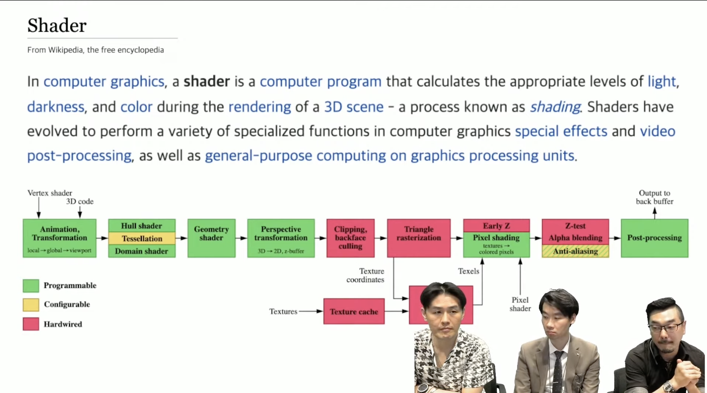
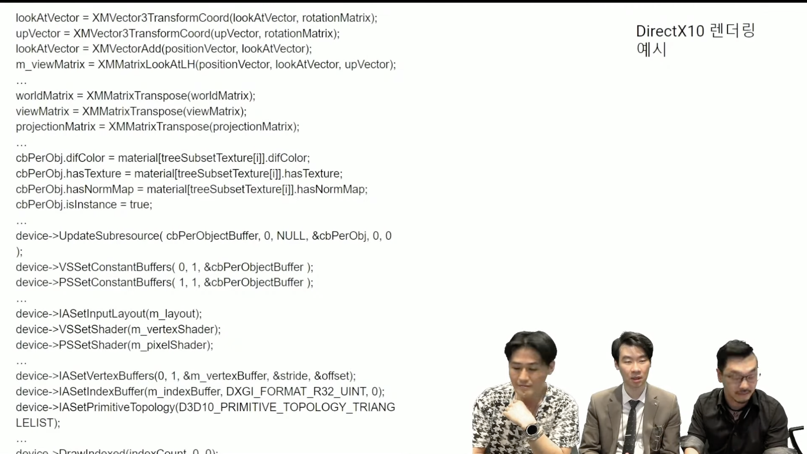

# 그래픽스 라이브러리

1. Direct X
2. Open GL | ES
3. Vulkan
4. Metal

Unity에서 사용하면, 각 플랫폼에 맞게 그래픽 파이프라인을 변환 합니다.

Auto Graphics API를 체크하면, 자동으로 변환합니다.

# 그래픽스 파이프 라인

# 그래픽 변환 과정

# 메모리 세팅 과정

# Command Buffer

# Shader

- GPU의 입장에서는 아래와 같이 여러개로 쪼개져서 넘어가게 됩니다.

DirextX 10 렌더링

# Reference

[유니티 Tips OpenGL, Material, Shader](https://www.youtube.com/watch?v=r3OdEzAKGBI)

[Typora 정보](https://futurecreator.github.io/2018/07/20/what-are-the-best-markdown-editor/)