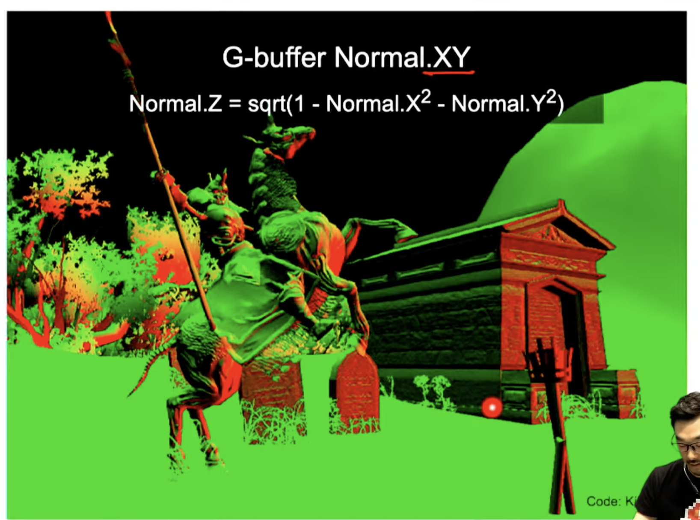
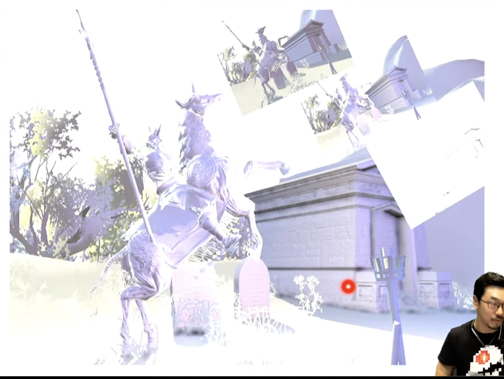
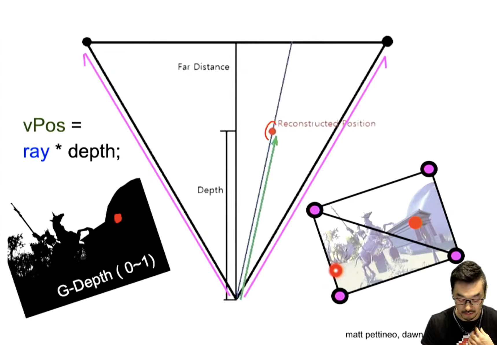
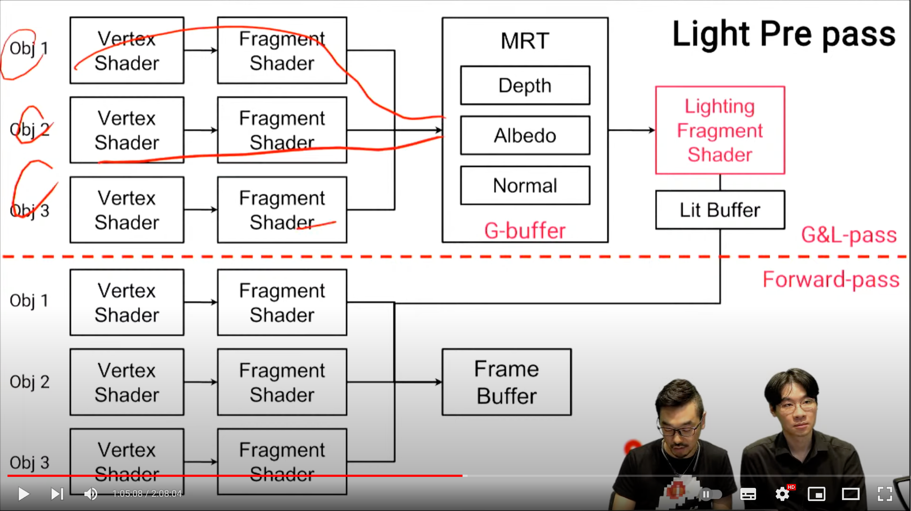
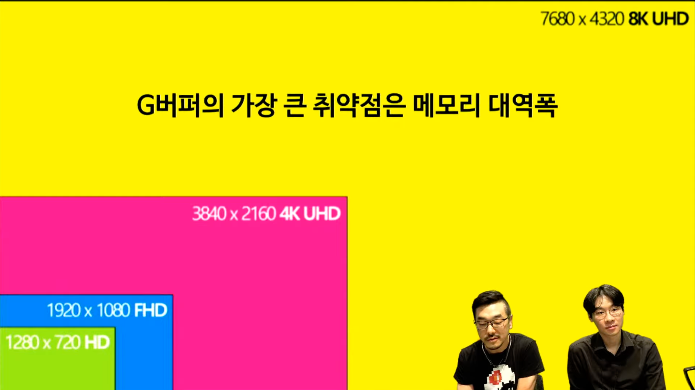
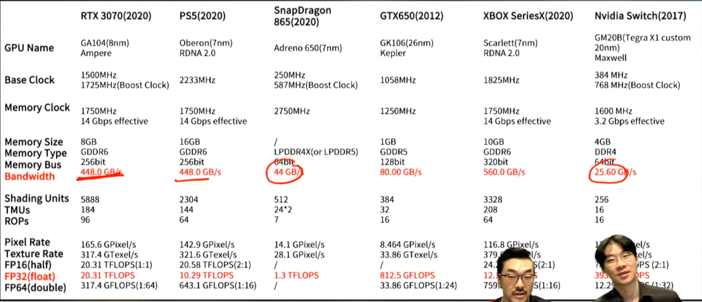
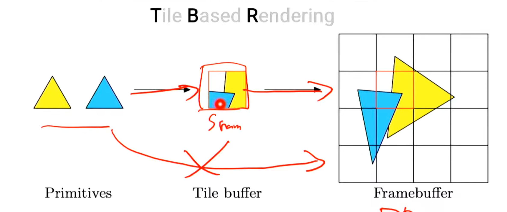
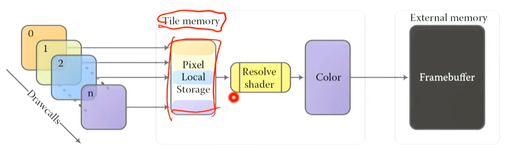
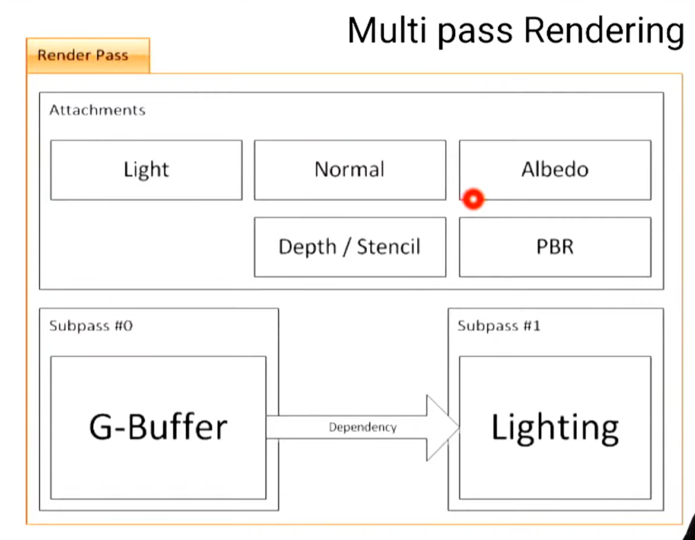

# Deferred Rendering

 수 많은 동적 라이트를 다루는 기법을 말합니다.

 본격적으로 사용하기 시작한 시점은 2010년 부터 사용하기 시작했습니다.

 오브젝트를 하나, 하나 그릴 때 마다 바로 라이팅을 하는것이 아니라, 지연 시켰다가 라이팅을 합니다.

- Diffuse -> Depth -> normal 등의 데이터를 Geometry Buffer에 저장하였다가, 라이팅을 연산 합니다.
- 라이팅과 오브젝트 연산을 분리해서 처리하기 때문에 라이팅의 개수에 영향을 덜 받습니다.

# Render Target

- Render Target은 렌더링하는 타겟을 설정하는 것을 말합니다.
- Render Textre와 연관이 있습니다.
- Multi Render Targets (Diffuse, Depth, normal)은 줄여서 MRT라고 부릅니다.
- 해당 사항은 대여폭 문제가 발생합니다.

# Deffered

- MRT 과정을 거친다음, Ligthing fragment Shader에서 계산을 합니다.

- Point Light

  

- Depth, view-space normal, Specular intensity, Albedo

- Normal, Depth Specular, Diffuse Mask

  

- Normal
  - X와 Y만 알면, Z를 알아낼 수 있습니다.
  - Deferred에서는  Normal은 1이어야 합니다. 

- Depth Specular

  

- Linear Depth

- 두개의 직각 삼각형이 있을 때, 삼각비가 적용됩니다.

- 순서

- G Buffer 구성은 아래와 같습니다.
  - 요즘 하드웨어는 Depth 버퍼를 읽어오는 기능을 제공합니다.

- Light Pre pass 

- G버퍼의 가장 큰 취약점은 메모리 대역폭

- Inferred Lighting

  대여폭을 줄여보자 하는 몸부림

  G버퍼의 사이즈를 줄여서 만드는 내용

  

- G버퍼 (MRT)의 가장 큰 문제는 대여폭의 문제가 있습니다.

- 모바일에서는 아래와 같이 대여폭이 특히 문제가 됩니다.

  

- Tile-based GPU(Tile Based Deferred) Rendering

- GPU가 타일 버퍼를 가지고 있어서 Tile 안에서 렌더링하고 전달합니다.

  

Multi pass Rendering

- 그래픽 API에서 Multi pass Rendering을 적용합니다.
- Render Path를 타일별로 작동하게 만들어 줄 수 있습니다.

- Native RenderPass를 켜줘야 TBR을 사용할 수 있습니다.

URP의 Deferred

- 모바일 GPU 최적화 작업

- OpenGL ES 미지원 (fallback : Forward)

- Forward pass : Complex Lit, Transparent 등

- Deferred는 MSAA 불가

# Reference

[렌더링 기법](https://www.youtube.com/watch?v=anz5bHVbeEY)