# Universal RP 14

Forward+ 가 Universal RP 14버전에 추가 되었습니다.

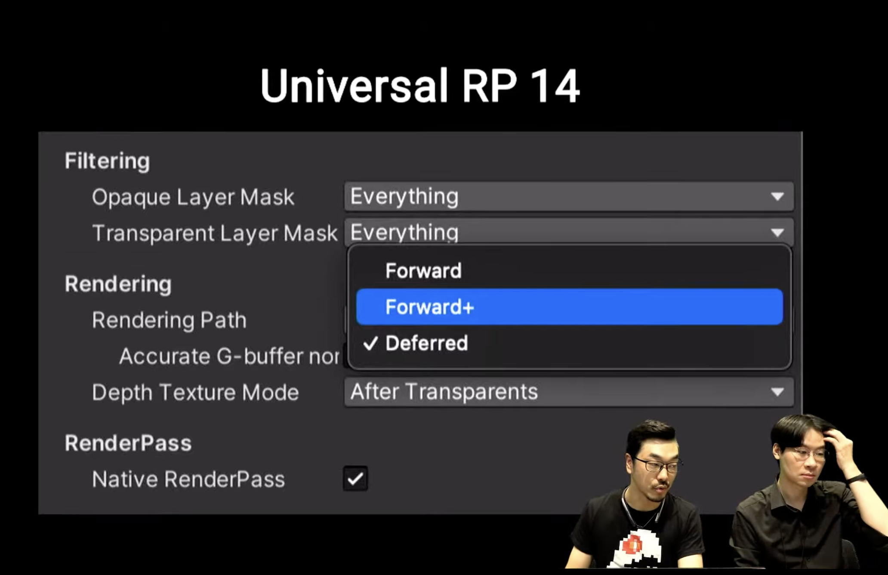

렌더링 / 셰이딩 / 라이팅 기법 여정

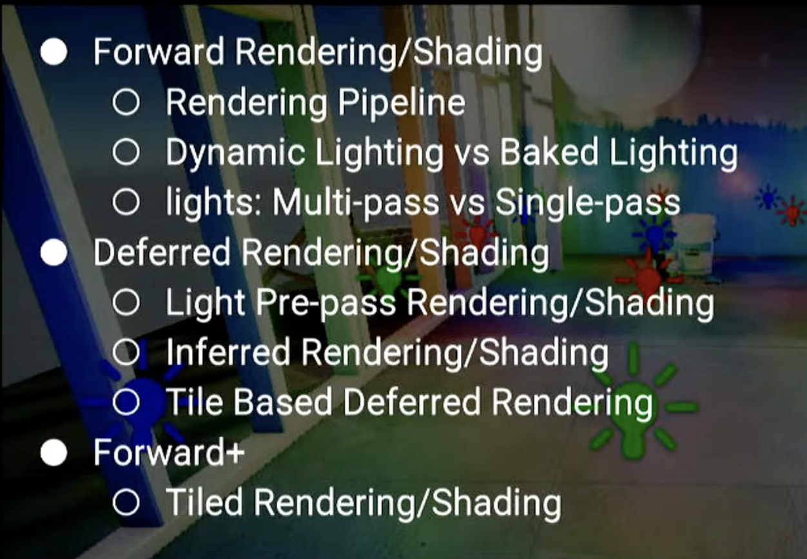

Realtime : 실시간 라이팅 연산으로 동적으로 라이팅을 연산을 합니다.

Baked : [라이트 맵, 라이트 프로브] 등이 있습니다.

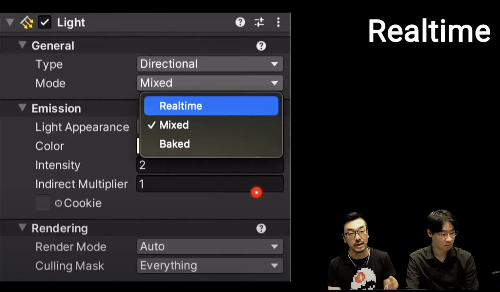

Forward Rendering

 전통적인 렌더링 기법을 말합니다.

 2개 오브젝트가 있고, 앞에 있는 오브젝트 먼저 그립니다. 

 겹치는 영역은 픽셀을 절약할 수 있습니다.

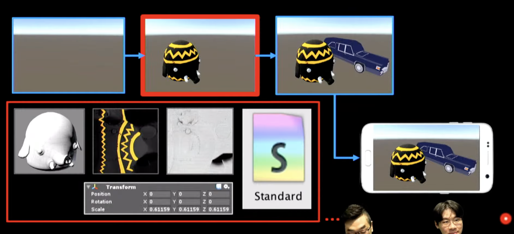

아래는 Mesh 생성 과정입니다.

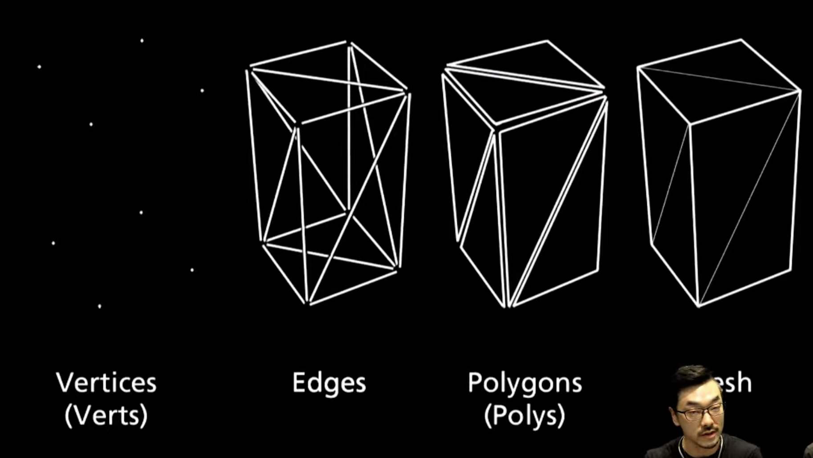

World View Projection Transform

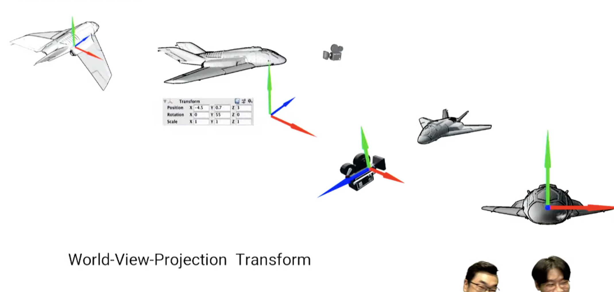

Rendering Pipeline

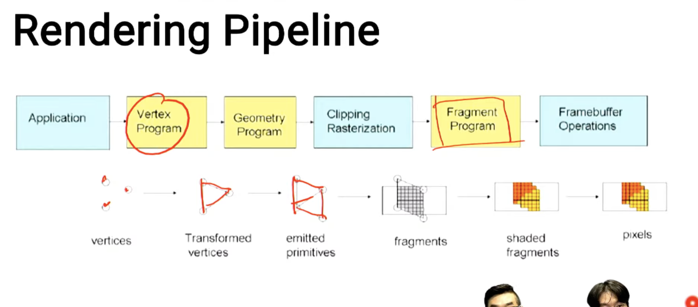

Depth Buffer

- 픽셀들의 깊이를 표현하는 버퍼를 말합니다.
- 앞에 있는 오브젝트에 겹치는 경우, 연산을 건너뛰게 됩니다.
- UI의 Order Layer은 Rendering 순서를 사용합니다.
- 해당, 사항들은 모두 불투명 오브젝트에 적용됩니다.

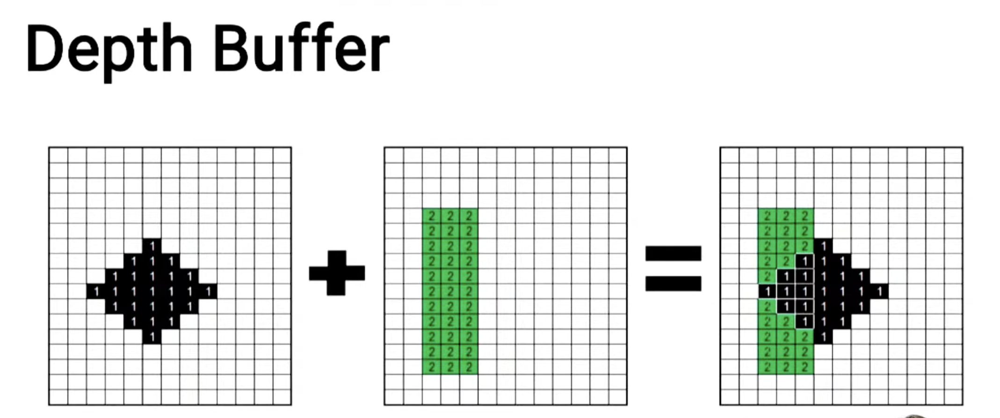

아래는 Depth Buffer의 모습입니다.

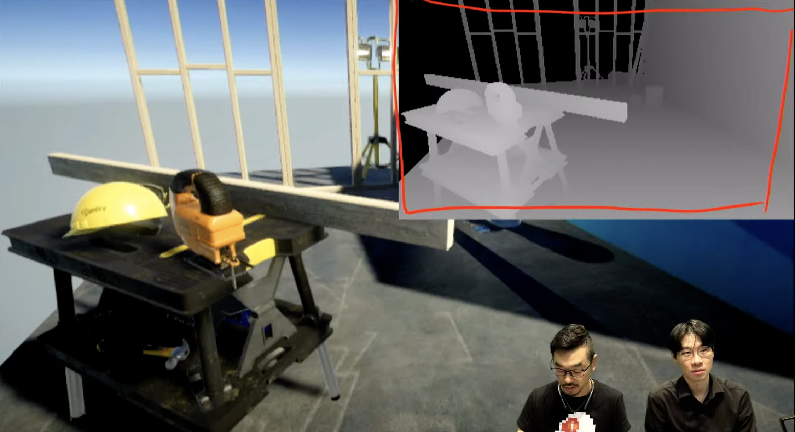

Double Buffering

- Double Buffering은 Back Buffer와 Front Buffer를 Swap 하는 과정을 말합니다.
- Back Buffer는 프레임 버퍼를 말합니다.
- Front Buffer는 Display와 연결이 됩니다.

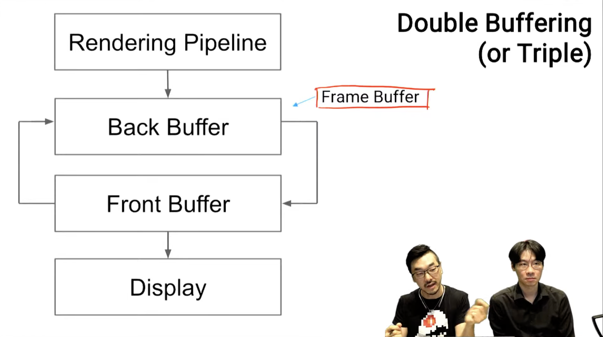

# 렌더링 과정

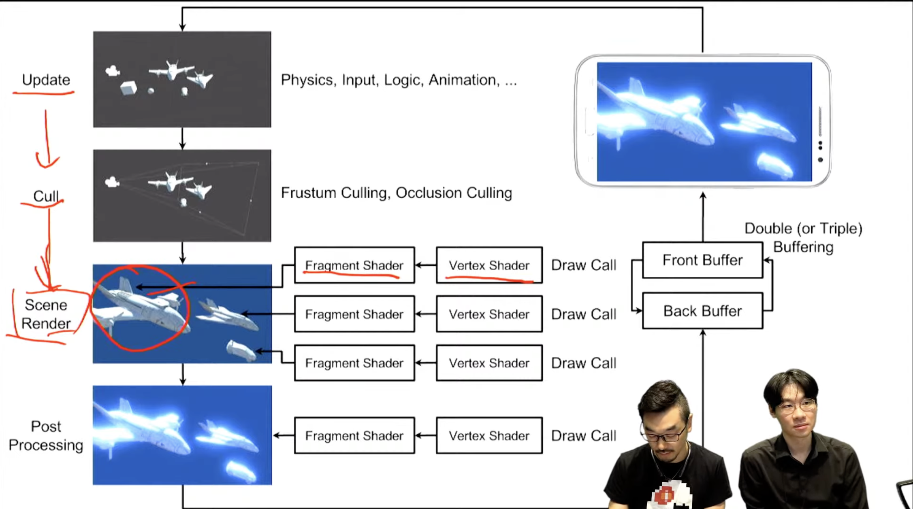

# Lights

1. Multi-lights in Multi-pass

   Built-in에서는 광원이 5개 * 오브젝트 10개 = > 50 드로우 콜

   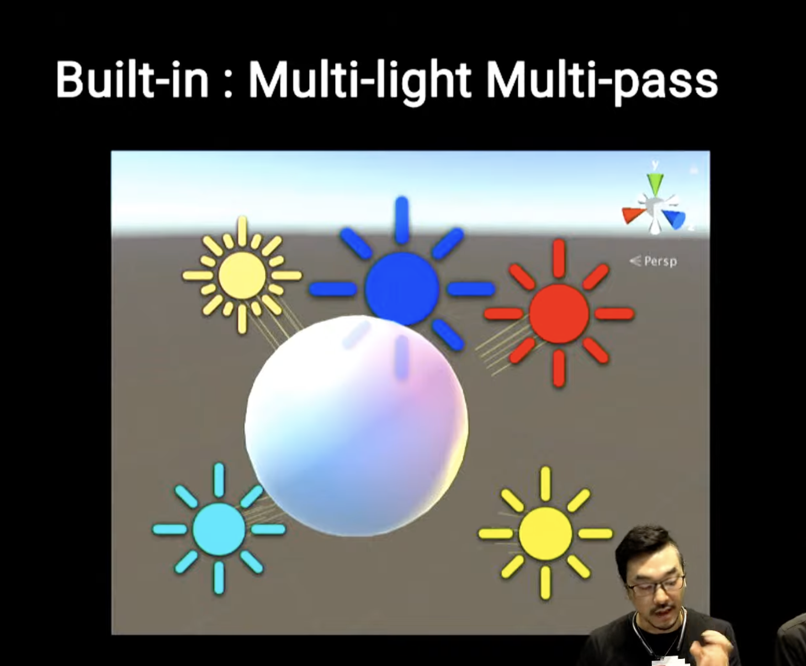

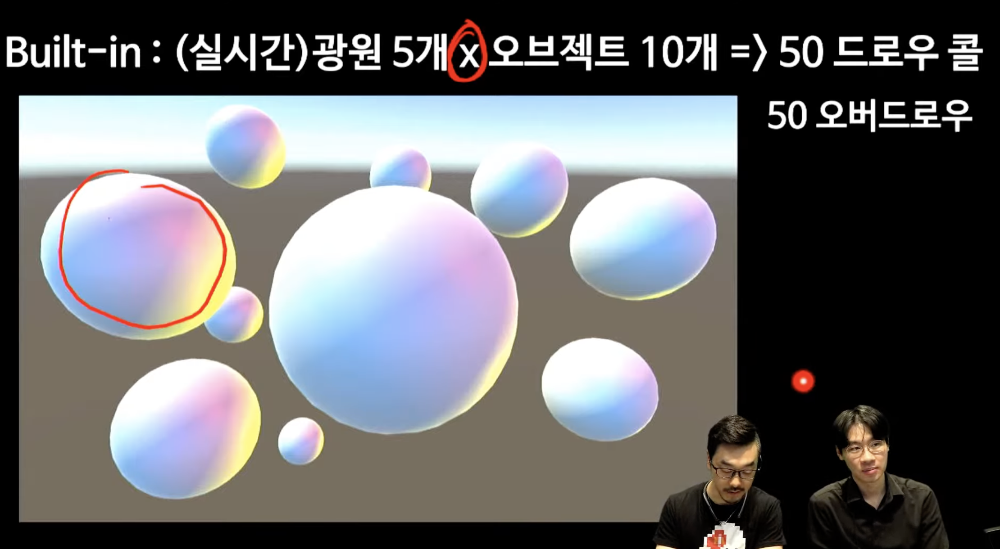

1. Multi-light Single-pass
   - 셰이더 안에서만 누적해서 처리 합니다.

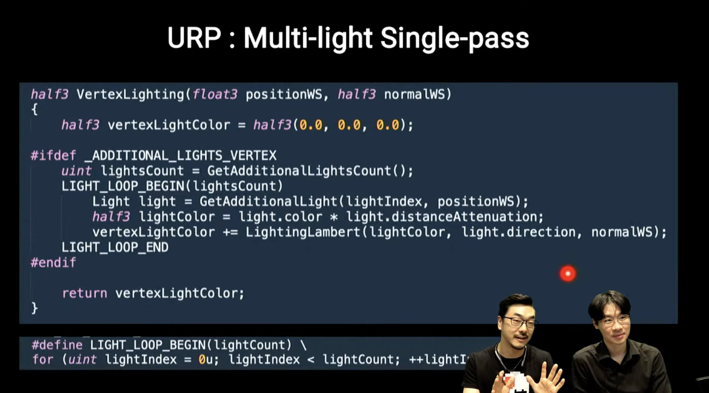

- Per Object Limit : 오브젝트 당, 몇개 까지 라이트를 할 수 있는지 제어 하는 옵션

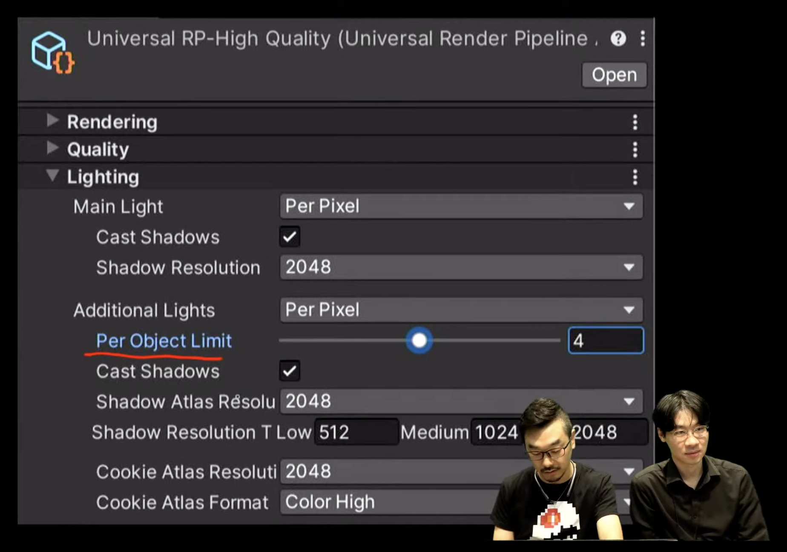

Additional Lights : 버텍스 연산을 할지, 픽셀 연산을 할지 선택을 할 수 있습니다.

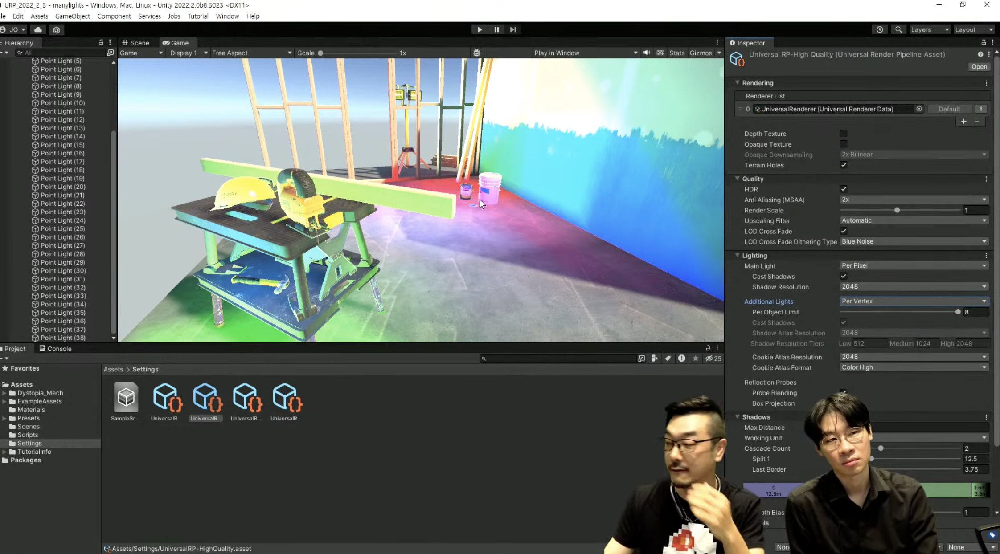

오브젝트 하나에 8개까지 빛을 표현할 수 있습니다.

# Froward Rendering

수 많은 동적 라이트를 다루는 데에는 한계가 존재합니다.

멀티패스로 성능을 포기하거나 (Built-in)

싱글 패스로 라이트를 제한하거나 (URP)

# Reference

[렌더링 기법](https://www.youtube.com/watch?v=anz5bHVbeEY)